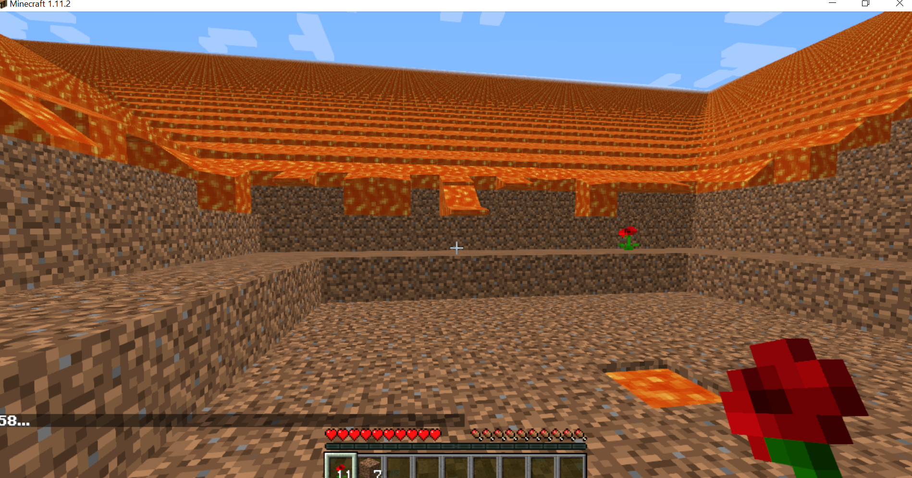
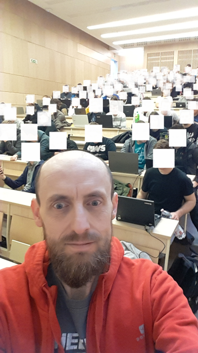
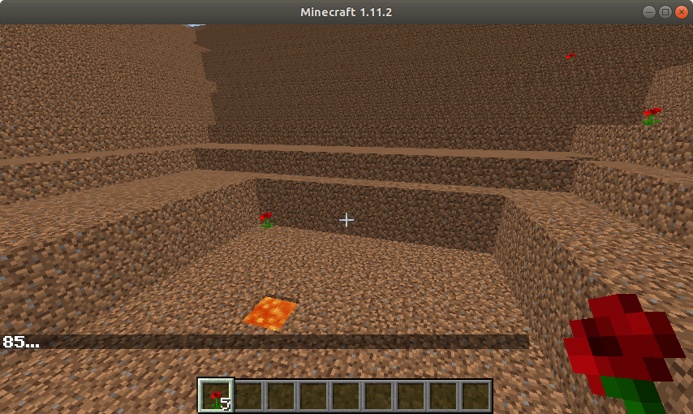

Red Flower Hell in Minecraft MALMÖ
==================================
NB4tf4i's Red Flowers (Red Flower Hell) - DEAC-Hackers Battle Royale Arena
--------------------------------------------------------------------------

* HI agents: [initial hack](https://youtu.be/SQSoLiRM1MQ): 18,  [world record](https://youtu.be/8yLmkjc2OiI): 46 poppies
* SW agents: [initial hack](https://youtu.be/WaXQtsc1tHQ): 13, [world record](https://youtu.be/trvcZtFgXdQ): 53 poppies
* AI agents: there are no such agents at this moment, initial hack: -, world record: - poppies
* AGI agents: there are no such agents at this moment, initial hack: -, world record: - poppies

# Red Flower Hell
Nowadays the key players in the artificial intelligence industry have their own platform for AGI research that is typically built on some well-known current or former game title. For example, Google uses the [Quake III Arena](https://github.com/deepmind/lab) and [Star Craft II](https://github.com/deepmind/pysc2).
Microsoft uses [Minecraft](https://www.microsoft.com/en-us/research/project/project-malmo/) for similar research purpose [1].

The [Project MALMÖ](https://github.com/Microsoft/malmo) is a Minecraft mod created by the Microsoft. Now we have started to use MALMÖ in education of programming. Then based on the experience gained with this we would like to use it in AGI research too. For this purpose we have begun to experiment with our own series of competitions called **Red Flower Hell**. The specific purpose of this challenge series is to collect as many red flowers as possible before the lava flows down the hillside as it can be seen in the following figure. 

## Human Intelligence agents (HI agents)
In the elements of Red Flower Hell series we are going to develop intelligent agents to collect poppies. After this we would also like develop AGI agents in this environment. It is therefore essential to know that how many poppies can a human player collect?

[nb4tf4i.xml](RFH0-3/nb4tf4i.xml)  
[nb4tf4i_red_flower_hell_basic_human.py](RFH0-3/nb4tf4i_red_flower_hell_basic_human.py)

HI Agents Results

* [initial hack](https://youtu.be/SQSoLiRM1MQ): 18, N. Bátfai
* [world record](https://youtu.be/8yLmkjc2OiI): 46 poppies, I. Horváth

## Software agents (SW agents)
These programs do not contain the usual MI solutions (such as graph searching or Q-learning), but only naive heuristic algorithms.

### Family circle (with my children)

The first experiments with MALMÖ  we had taken in our immediate family circle as we did with, for example,  project [BrainB](https://www.twitch.tv/videos/139186614) [1] or [SMNIST](https://youtu.be/-tSRwJgVpJk) [2]. We have played  [with](https://youtu.be/bAPSu3Rndi8) cheating (using ObservationFromGrid) and [without](https://youtu.be/x52iPOwwMn4) cheating as well.


### Study circles (for primary and secondary school pupils and students)

#### First circle
[Demo](https://youtu.be/uA6RHzXH840)  

[nb4tf4i.xml](RFH0-3/nb4tf4i.xml)  
[nb4tf4i_red_flower_hell_basic.py](RFH0-3/nb4tf4i_red_flower_hell_basic.py)

* Modify the initial loop
```python
# Loop until mission ends:
while world_state.is_mission_running:
    print("--- nb4tf4i arena -----------------------------------\n")
    self.agent_host.sendCommand( "move 1" )
    time.sleep(.5)            
    self.agent_host.sendCommand( "turn 1" )
    time.sleep(.5)
    world_state = self.agent_host.getWorldState()
```
to rotate Steve at half speed.
* Modify the loop to move Steve forward and backward.
* Modify the loop to move Steve forward by turning right and left (zig-zag).
* Modify the loop to walk Steve
around in the arena.
* Modify the loop to move up Steve
in spiral line in the arena until he reach the lava.

#### Second circle
[Demo](https://youtu.be/Fc33ByQ6mh8)  

[nb4tf4i_d.xml](RFH0-3/nb4tf4i_d.xml)  
[nb4tf4i_red_flower_hell_basic_d.py](RFH0-3/nb4tf4i_red_flower_hell_basic_d.py)

```python
# Loop until mission ends:
while world_state.is_mission_running:
    print("--- nb4tf4i arena -----------------------------------\n")
    self.agent_host.sendCommand( "move 1" )
    time.sleep(.5)            
    self.agent_host.sendCommand( "move 1" )
    time.sleep(.5)            
    self.agent_host.sendCommand( "move 1" )
    time.sleep(.5)            
    self.agent_host.sendCommand( "turn 1" )
    time.sleep(.5)
    world_state = self.agent_host.getWorldState()
```

Let's do the same task as in the first circle but now with using [discrete motion commands](https://microsoft.github.io/malmo/0.17.0/Schemas/MissionHandlers.html#type_DiscreteMovementCommand).

#### Third circle
[Programming task](https://youtu.be/-GX8dzGqTdM)  
[nb4tf4i_red_flower_hell_basic_d_sense.py](RFH0-3/nb4tf4i_red_flower_hell_basic_d_sense.py)

```python
class Steve:
    def __init__(self, agent_host):
        self.agent_host = agent_host
        self.x = 0
        self.y = 0
        self.z = 0        
        self.yaw = 0
        self.pitch = 0        

    def run(self):
        world_state = self.agent_host.getWorldState()
        # Loop until mission ends:
        while world_state.is_mission_running:
            print("--- nb4tf4i arena -----------------------------------\n")
            if world_state.number_of_observations_since_last_state != 0:

                sensations = world_state.observations[-1].text
                print("    sensations: ", sensations)                
                observations = json.loads(sensations)
                nbr3x3x3 = observations.get("nbr3x3", 0)
                print("    3x3x3 neighborhood of Steve: ", nbr3x3x3)

                if "Yaw" in observations:
                    self.yaw = int(observations["Yaw"])
                if "Pitch" in observations:
                    self.pitch = int(observations["Pitch"])
                if "XPos" in observations:
                    self.x = int(observations["XPos"])
                if "ZPos" in observations:
                    self.z = int(observations["ZPos"])        
                if "YPos" in observations:
                    self.y = int(observations["YPos"])  

                print("    Steve's Coords: ", self.x, self.y, self.z)        
                print("    Steve's Yaw: ", self.yaw)        
                print("    Steve's Pitch: ", self.pitch)
```

* Modify this code to print what Steve sees.

Hint:   
```python
if "LineOfSight" in observations:
    lineOfSight = observations["LineOfSight"]
    self.lookingat = lineOfSight["type"]
print("    Steve's <): ", self.lookingat)
```
* Then modify the code further to print a debug message if Steve sees a red flower.  
A solution can be seen in this video: https://youtu.be/mT9FOzzSjUI

* Finally, modify the code to mine a red flower.

#### Fourth circle

[Programming task](https://youtu.be/I6n8acZoyoo): Steve should go up to the lava then come back down to the starting level walking ahead of the lava.

#### Fifth circle

Let's do the same task as in the previous circle but now with using 5x5x5 or 7x7x7 grid of blocks in ObservationFromGrid.

### Courses (for university students)
In these courses students can earn extra points by solving MALMÖ based programming tasks.

#### High-level programming languages I
[Syllabus](http://smartcity.inf.unideb.hu/~norbi/P1/SillabuszProg1.pdf), [lectures](https://arato.inf.unideb.hu/batfai.norbert/UDPROG/deprecated/), [laboratory work](https://gitlab.com/nbatfai/bhax/-/tree/master/thematic_tutorials/bhax_textbook_IgyNeveldaProgramozod), [community](https://www.facebook.com/groups/udprog/).

  
There are usually roughly 130 students in the High-level programming languages I lecture. This picture was taken on Wed, 19 Feb 2020.

The purpose of the following contests (Red Flower Hell I.-IV.) is to gain experience in agent programming. There is no reward or prize. We play the game for the game's sake.

##### Red Flower Hell I.

10 Feb - 2 Mar   
Using ObservationFromGrid has already been a cheating in itself. But in this first round there are no rules, anything is allowed, for example the students can use directly the coordinates of flowers from mission XML file with the teleport command... and so on.

How to participate? Comment the link of your YouTube video to the post: https://www.facebook.com/groups/udprog/permalink/1337108209810398/

Results
* [initial hack](https://youtu.be/WaXQtsc1tHQ): 13 poppies, Bátfai, N. (without AbsoluteMovementCommand)
* first place: 58 poppies, there was a dead heat for first place between [Pusztai, R.](https://youtu.be/_yIQe9iiaL4) (with trivial teleporting), [Hajdu, B.](https://youtu.be/VPrzLiI8_oU) (with using water), [Nagy, V.](https://youtu.be/UWRm2iQGiC0), [Kusmiczki, B. & Nagy, E.](https://youtu.be/RPvSv5jmzho), [Bence, C. & Barna, B.](https://youtu.be/JD4-sZ9BqGw), [Kálny, Z. & Szilágy Z.](https://youtu.be/2TU8KTtcNr4), [Salánki, L. & Kovács, I.](https://youtu.be/-Y_aFPxT4Nw), [Nagy, L. E. & Tódor, G.](https://youtu.be/GgpDeO4GUdA), [Takács, B.](https://youtu.be/kLaV9kENU2s), [Szabó, B. & Pete, B.](https://youtu.be/TcBYAAp4Og0), [Hosszú, Sz.](https://youtu.be/0gXwCGaJCyc), [Semendi, Á.](https://youtu.be/E4VIvq39FZE) and [Béres, M.](https://youtu.be/dbhrMjtxXgM) (with trivial teleporting)
* [second place](https://youtu.be/FFswEcKiC2s): 57, Kántor, D.
* third place: -

Summary: the purpose of this round was to install and learn about MALMÖ.

##### Red Flower Hell II.

2 Mar - 23 Mar  

Based on experience gained in the first round, the following are prohibited:
* using the data of the mission XML file
* using [absolute movement commands](https://microsoft.github.io/malmo/0.17.0/Schemas/MissionHandlers.html#type_AbsoluteMovementCommand)
* modifying the mission XML file
* changing the game mode
* gaining mouse control

How to participate? Comment the link of your YouTube video to the post: https://www.facebook.com/groups/udprog/permalink/1342653805922505/

Results
* [initial hack](https://youtu.be/g_nWTXByPbs): 14 poppies, Bátfai, N.
* first place: 53 poppies, [Káplár, I. & Halász, D.](https://youtu.be/trvcZtFgXdQ)
* second place: 41 poppies, [Kiss, K. & Hegedűs, P.](https://youtu.be/bkaLZ_Lo3QI)
* third place: 39 poppies, [Hajdu, B.](https://youtu.be/0W_Oaxg2uyg), [Takács, B. & Szabó, D.](https://youtu.be/mGNQyU3lz9k)
* 4-th place: 37 poppies, [Káplár, I. et al.](https://youtu.be/ul70t9PZLrc)
* 5-th place: 28 poppies, [Szoboszlai, I. & Kiss, D.](https://youtu.be/bl2Y2JeVv88)
* 6-th place: 26 poppies, [Nagy, E. & Kusmiczki, B.](https://youtu.be/B2YqNn274vA)
* 7-th place: 24 poppies, [Bátfai, N.](https://youtu.be/sH4nlNheNf4)
* 8-th place: 23 poppies, [Kántor, D.](https://youtu.be/6hb-MaX2OAE), [Tóth, F.](https://youtu.be/k6H4ir1zv-4)  
* 9-th place: 22 poppies, [Kiss, D.](https://youtu.be/HimY1E09DTQ)
* 10-th place: 21 poppies, [Hajdu, B. & György, D.](https://youtu.be/22t7Jhanl8Q)
* 11-th place: 20 poppies, [Szoboszlai, I.](https://youtu.be/RNrPnC6a5J4), [Zselenák, F.](https://youtu.be/Cfbs-4_ivzo), [Puskás, P.](https://youtu.be/SCwtrRw3_VI)
* 12-th place: 19 poppies, [Bátfai, N.](https://youtu.be/VP0kfvRYD1Y), [source code available](RFH0-3/nb4tf4i_d_rfh2_bu_smartSteve_s4.v3.py)
* 13-th place: 17 poppies, [Olasz, Zs. & Ignácz, M.](https://youtu.be/shMWqpyP8QU)

##### Red Flower Hell III.

23 Mar - 6 Apr

Qualification limit: 25 poppies. The deadline for submission of the source code of your SF agent is 1 Apr. There will be online qualifiers followed by ~~offline~~ (online because coronavirus) finals at the spring school holidays. Until now the red flowers have always been placed to the same place.
In the finals, the locations of the red flowers will be re-generated. (For example, try this mission XML file: [nb4tf4i_d_2.xml](RFH0-3/nb4tf4i_d_2.xml) )

How to participate? Comment the link of your YouTube video to the post:
https://www.facebook.com/groups/udprog/permalink/1359276454260240/

Qualification Results
* [initial hack](https://youtu.be/cfhh3llDoRo): 28 poppies, Bátfai, N., [source code available](RFH0-3/greenpill_s24_v3_RF28.py)
* first place: 50 poppies, [Káplár, I. & Halász, D.](https://youtu.be/F3vZ432GOlg)
* second place 48 poppies, [Kiss, K. & Hegedűs, P.](https://youtu.be/Cwj3s4-MFlg)
* third place 44 poppies, [Hajdu, B. & Dávid, Gy.](https://youtu.be/L1YDl1GEdsY)
* 4-th place 43 poppies, [Kálmán, I.& Katona, A.](https://youtu.be/VJXIP7L_Hx0)
* 5-th place 40 poppies, [Szabó, B. & Pete, B.](https://youtu.be/4WJTLrBLhSI)
* 6-th place 38 poppies, [Hosszú, Gy. & Zselenák, F.](https://youtu.be/UbiBkkLx1Fk)
* 7-th place 37 poppies, [Hajdu, B. & Dávid, Gy.](https://youtu.be/c-wDeAHSA70)
* 8-th place 35 poppies, [Takács, B. & Szabó, D.](https://youtu.be/yq6zzmbKv8Y)
* 9-th place 34 poppies, [Kálmán, I. & Katona, A.](https://youtu.be/_oYPAeMzCYc)
* 10-th place 33 poppies, [Nagy, L. E. & Tódor, G.](https://youtu.be/WxEMSQYYYTM)
* 11-th third place 32 poppies, [Kántor, D.](https://youtu.be/3CGf8nQSc9s)
* 12-th third place 31 poppies, [Hosszú, Sz.](https://youtu.be/ZUnzzPzf2sI), [Czövek, B. & Barna, B.](https://youtu.be/JKD1jsf2M98)
* 13-th third place 30 poppies, [Szilágyi, Z. & Kálny, Z.](https://youtu.be/Bl_gHelncAQ), [Koncz, B.](https://youtu.be/CrYvSfbWJd0), [Bukovinszki, M.](https://youtu.be/Utm67HyzyuY), [Geszterédi, J. & Gyulai, D.](https://youtu.be/3l0kV-wF14A), [Puskás, P.](https://youtu.be/1CmJLiGSWeA), [Puzsár, B. & Gyulai, D.](https://youtu.be/qgciMktuhI8), [Nagy, G. & Szilágyi, M.](https://youtu.be/48Z-MffMeYo), [Nagy, E. & Kusmiczki, B.](https://youtu.be/di0QN3Q3860), [Szoboszlai, I. & Kiss, D.](https://youtu.be/QsqIU8ZDllA)
* 14-th third place 29 poppies, [Hosszú Gy. & Zselenák F.](https://youtu.be/aZV01QeVO-w), [Kántor, D.](https://youtu.be/8kOorpfhXT4), [Koncz, B.](https://youtu.be/W5aXgJO4dTY), [Szimeonov, V.](https://youtu.be/9axEXwNtdKA), [Kalló, Gy. D. & Minya, Á.](https://youtu.be/98kdS6v9Gho), [Pintér, B. & Somogyi, V.](https://youtu.be/_Geq5MxDnE0), [Jakab, A.](https://youtu.be/WM38iZmjCwk), [Szoboszlai, I. & Kiss, D.](https://youtu.be/2NgwzCue4RQ)
* 15-th third place 28 poppies, [Bátfai, N. B.](https://youtu.be/HUKsXKmG2Hg), [Szoboszlai, I. & Kiss, D.](https://youtu.be/RTyyW5qfvFA), [Pálffy, V.](https://youtu.be/JyHDbm_8O9U), [Szilágyi, Z. & Kálny, Z.](https://youtu.be/wPvBTwPQvaI), [Nagy, E. & Kusmiczki, B.](https://youtu.be/X-LrGXy1tfs)
* 16-th third place 27 poppies, [Tutor, T. & Czanik Tony, A.](https://youtu.be/xtwaPfWQyNQ)
* 17-th third place 26 poppies, [Szabó, B. & Pete, B.](https://youtu.be/jwbmBLFpaWw), [Bukovinszki, M.](https://youtu.be/_3aTNxOBZOY)  

Final Results
* [Day 1](https://youtu.be/OmNhgKC1c3s), [Day 2](https://youtu.be/kU7U9vBHfgk), [Day 3](https://youtu.be/dKWSLyfJbTs),  
[source codes available](https://github.com/nbatfai/RedFlowerHell/tree/master/competitions/RFHIII/2019-2020)
* first place: 46 poppies, there was a dead heat for first place between **Káplár, I. & Halász, D.** and **Kiss, K. & Hegedűs. P.**
* second place: 43 poppies, **Hajdu, B. & Dávid, Gy.**  
* third place 40 poppies, **Szabó, B. & Pete, B.**
* 4-th place 38 poppies, **Nagy, L. E. & Tódor, G.**
* 5-th place 36 poppies, **Kálmán, I. & Katona, A.**
* 6-th place 34 poppies, **Takács, B. & Szabó, D.**
* 7-th place 22 poppies, **Kántor, D.**
* 8-th place 11 poppies, **Hosszú, Gy. & Zselenák, F.**


##### Red Flower Hell IV. - "RFH Rudolph"

13 Apr - 8 May

Mission XML files:
* Hard League [nb4tf4i_d4_Rudolf_hard.xml](RFH4/nb4tf4i_d4_Rudolf_hard.xml)
* Soft League [nb4tf4i_d4_Rudolf_soft.xml](RFH4/nb4tf4i_d4_Rudolf_soft.xml)

Qualification limit: (hard: 5/soft: 9) poppies. The deadline for submission of the source code of your SF agent is 8 May. In this round the full arena will be re-generated: not only the coords of the red flowers but also the walls of the hillside will change as it can be seen in the following figure.


[Rudolf](https://youtu.be/RShUsRJKIWI) has been chosen as the default arena for RFH IV.

How to participate? Comment the link of your YouTube video to the post:
https://www.facebook.com/groups/udprog/permalink/1380895935431625/

HI Agents Results (Human)
* initial hack: [Please use this source for measuring](https://github.com/nbatfai/RedFlowerHell/blob/master/RFH0-3/nb4tf4i_red_flower_hell4_greenpill_human.py)
* current first place: 38 poppies, [Aranyi, Á.](https://youtu.be/NJrxqkqw2OU)
* current second place: 36 poppies, [Zsabej, M.](https://youtu.be/c_NXSpkYN38), [Szabó, B.](https://youtu.be/GZZTJxY1U8k)
* current third place: 34 poppies, [Szoboszlai, I.](https://youtu.be/enyH_GdOYS8)
* 4-th place: 30 poppies, [Geszteredi, J.](https://youtu.be/czqNHVVnw00), [Gyulai, D.](https://youtu.be/dr89iDj6FPw)
* 5-th place: 28 poppies, [Takács, B.](https://youtu.be/r23rHdnYF9o), [Tóth, F.](https://youtu.be/kdF-5dRbCDQ)
* 6-th place: 27 poppies, [Bartha, Z.](https://youtu.be/RHoJiMmbnu4)
* 7-th place: 26 poppies, [Kiss, D.](https://youtu.be/Mw7NZCEV2us)
* 8-th place: 23 poppies, [Puskás, P.](https://youtu.be/m8i4U-Y4z30), [Vékony, O.](https://youtu.be/Yzmpkz-ahOs)
* 9-th place: 22 poppies, [Tari, L.](https://youtu.be/lHBoGrAaJ9M)
* 10-th place: 19 poppies, [Papp, Cs.](https://youtu.be/o6prMQCZcG4)

Qualification Results (Hard)
* [initial hack](https://youtu.be/ZTsXkMh3pqQ): 5 poppies, Bátfai, N. & Bátfai, N. B., [source code available](RFH4/nb4tf4i_red_flower_hell4_greenpill_agens_c_rf5.py)
* first place: 14 poppies, [Osztós, Zs.](https://youtu.be/FkJUB-TIvb0)
* second  place: 10 poppies, [Aranyi, Á.](https://youtu.be/IQJUw0Obyac) (Py)
* third place: 9 poppies, [Tutor, T. & Czanik, A.](https://youtu.be/5wMRgiSBc7k) (Py)
* 4-th place: 8 poppies, [Szakács, Á. & Fiedler, N.](https://youtu.be/6YtfOEV7U54) (C++), [Tutor, T. & Czanik, A.](https://youtu.be/_21OkBUF-GU), [Aranyi, Á.](https://youtu.be/R5ZDImomRZ4) (C++)
* 5-th place: 7 poppies, [Tóth, F.](https://youtu.be/A_BVE7Mf5Qc) (C++), [Tari, L., Naghi, P. & Sándor, M.](https://youtu.be/8sdaxf2_93A), [Brudnyák, B.](https://youtu.be/bjWw0Vzghvw) (Py), [Takács, B. Dávid Kiss, D. & Vékony, O.](https://youtu.be/Wg-lFWiOy5M) (C++)
* 6-th place: 6 poppies, [Bartha, Z.](https://youtu.be/ReQjdP3IC4w) (Py), [Barna, B.](https://youtu.be/MrZ3BgwDTQg)
* 7-th place: 5 poppies, [Takács, B. & Vékony, O](https://youtu.be/F74t6sZdrQ0) (Py), [Nagy, E. & Kusmiczki, B.](https://youtu.be/NMsT2TCfLDo), [Szoboszlai, I.](https://youtu.be/0RIWwGUGDH0), [Kovács, I.](https://youtu.be/e5EyzzD9PoM), [Szabó, P.](https://youtu.be/7IFqLEZNQvI), [Tóth, F.](https://youtu.be/D6qY-zmOKxw) (Py), [Veress, G. & Nyika, B.](https://youtu.be/BZ9lqMwtePs) (Py), [Hegedűs, P.](https://youtu.be/DUj6nNpaiug) (Py), [Sápi, G.](https://youtu.be/ilI5LQ5kWWE) (Py), [Orosz, R.](https://youtu.be/OkG1NRkzh1o), [Puskás, P.](https://youtu.be/Bnx00RwZ7HQ), [Gyulai, D.](https://youtu.be/RLGkfOmlmbQ)


Qualification Results (Soft)
* first place: 13 poppies, [Takács, B. & Vékony, O](https://youtu.be/k3YiFq0xWOg) (Py)
* second place: 9 poppies, [Takács, B. Dávid Kiss, D. & Vékony, O.](https://youtu.be/Xf2T3NRswS0) (C++)
* third place: 5 poppies, [Takács, B. & Vékony, O](https://youtu.be/k3YiFq0xWOg) (Py)

Final Results (Hard)
* initial hack: -
* current first place: -
* current second place: -
* current third place: -  

Final Results (Soft)
* initial hack: -
* current first place: -
* current second place: -
* current third place: -  


#### High-level programming languages II
See AI agents

#### Esport
See AGI agents


## Artificial Intelligence agents (AI agents)


## Artificial General Intelligence agents (AGI agents)

## Our other Minecraft-based activities

* [Szolon Hackerei - Esport és Programozás Verseny](http://smartcity.inf.unideb.hu/~norbi/DEACH/DEACHMinecraft005.pdf)
* [„Debrecen a kockák origójában” - a DEAC-Hackers esport szakosztály Minecrafttal kapcsolatos koncepciója ](http://smartcity.inf.unideb.hu/~norbi/NB4tf4iRedFlowerHell/DEACH_BN_template4_2-toborzo-MC2-verseny-nb4tf4ai-pipacs.pdf)

# References

[1] Johnson, M., Hofmann, K., Hutton, T.,Bignell, D. (2016). The Malmo Platform for Artificial Intelligence Experimentation, 25th International Joint Conference on Artificial Intelligence, https://www.ijcai.org/Proceedings/16/Papers/643.pdf

[2] Bátfai, N., Papp, D., Besenczi, R., Bogacsovics, G., & Veres, D. (2019). Benchmarking Cognitive Abilities of the Brain with the Event of Losing the Character in Computer Games. Studia Universitatis Babeș-Bolyai Informatica, 64(1), 15-25. doi:10.24193/subbi.2019.1.02

[3] Norbert Bátfai, Dávid Papp, Gergő Bogacsovics, Máté Szabó, Viktor Szilárd Simkó, Márió Bersenszki, Gergely Szabó, Lajos Kovács, Ferencz Kovács, Erik Szilveszter Varga (2019). Object file system software experiments about the notion of number in humans and machines. Cognition, Brain, Behavior. An interdisciplinary journal. Volume XXIII, Nr 4, 257-280, doi:10.24193/cbb.2019.23.15

[4] Bátfai,  N., Csukonyi Cs., Papp D, Hermann Cs., Deákné O. E.,
Győri K. (2020) The DEAC-Hackers esport department's education and research concept in AI in Minecraft (accepted Hungarian manuscript)

___
Norbert Bátfai, PhD., University of Debrecen, IT Dept.,  batfai.norbert@inf.unideb.hu  
[nb4tf4i](http://mine.ly/nb4tf4i.1)

Last modified: Fri, 8 May 2020 11:59:00 GMT
